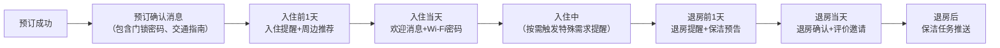
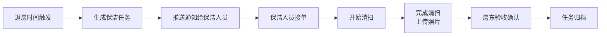

## 1. 产品概述

面向短租房东的自动化消息分发工具，解决多平台来客咨询、入住提醒和保洁协同内容重复发送的问题，通过6大模块实现全流程自动化，大幅提升运营效率。

- 核心价值：消除重复复制粘贴，统一管理多渠道沟通，让房东从繁琐的消息回复中解放出来
- 目标用户：拥有1套及以上短租房源的个人房东、小型民宿运营团队
- 市场价值：提升回复效率300%，降低人工出错率，确保入住体验一致性

## 2. 核心功能

### 2.1 用户角色
| 角色 | 注册方式 | 核心权限 |
|------|----------|----------|
| 房东/管理员 | 手机号注册 | 全部功能，房源管理、模板配置、数据统计 |
| 保洁人员 | 邀请链接加入 | 仅查看和处理保洁任务，更新任务状态 |

### 2.2 功能模块
1. **房源规则**：房源基础信息维护、渠道配置、门锁/交通信息、节假日规则
2. **消息模板**：多场景模板管理、变量替换、版本记录、常用语库
3. **会话汇总**：多渠道消息聚合、统一回复、人工接管、特殊需求标记
4. **日程触发**：入住生命周期自动提醒、定时任务、重复提醒防护
5. **保洁协同**：退房清扫任务推送、状态跟踪、异常上报
6. **效果统计**：模板改写分析、消息状态追踪、历史查询、沟通效率分析

### 2.3 页面详情

| 页面名称 | 模块名称 | 功能描述 |
|----------|----------|----------|
| 控制台首页 | 数据概览 | 今日待处理任务、消息统计、快捷操作入口、即将到来的入住/退房 |
| 房源管理 | 房源规则 | 房源列表、新增/编辑房源、渠道绑定、门锁信息、交通指南、节假日临时规则 |
| 模板中心 | 消息模板 | 模板分类列表（咨询/入住前/入住中/退房/保洁）、模板编辑器、变量插入、版本对比 |
| 消息中心 | 会话汇总 | 多渠道会话列表、会话详情、快捷回复、人工接管开关、特殊需求标记（婴儿床/延迟入住等） |
| 日程中心 | 日程触发 | 日历视图、入住/退房时间线、自动触发规则配置、触发历史记录 |
| 保洁中心 | 保洁协同 | 保洁任务列表、任务详情、状态流转、保洁人员管理、任务分配 |
| 数据分析 | 效果统计 | 模板使用率统计、改写率排行、消息送达/查看状态、房源沟通历史（近30天）、效率报表 |

## 3. 核心流程

### 3.1 咨询自动回复流程
1. 第三方平台（ Airbnb / 携程 / 美团 ）来客咨询
2. 系统接收咨询事件，识别渠道和房源
3. 判断当前时间是否深夜（22:00-08:00）
4. 是：发送简版等待回复，次日工作时间再推送详细信息
5. 否：根据咨询类型匹配对应模板，自动替换门锁说明、交通信息等变量
6. 发送消息，记录发送状态
7. 人工回复或标记人工接管后，暂停该客人的自动触发

### 3.2 入住全流程自动提醒

### 3.3 保洁任务协同流程

## 4. 用户界面设计

### 4.1 设计风格
- **主色调**：深蓝色 #1e3a5f（专业、信任），搭配深灰色 #2d3748（商务高效）
- **辅助色**：翡翠绿 #10b981（成功/完成）、琥珀橙 #f59e0b（警告/待处理）、玫瑰红 #ef4444（错误/紧急）
- **按钮风格**：直角矩形，轻微阴影，hover状态有颜色加深效果，强调商务专业感
- **字体**：展示字体使用 "Noto Sans SC" 粗体，正文字体使用 "Noto Sans SC" 常规体
- **布局风格**：左侧导航栏 + 顶部操作栏 + 主内容区三栏布局，卡片式信息展示
- **图标风格**：线性图标，统一2px线条，保持简洁专业

### 4.2 页面设计概述

| 页面名称 | 模块名称 | UI元素 |
|----------|----------|--------|
| 控制台首页 | 数据概览 | 4个数据卡片（今日消息/待处理任务/在住房源/今日保洁）、2个折线图（消息趋势/回复效率）、快捷操作区、即将入住列表 |
| 房源管理 | 房源规则 | 房源卡片列表（封面+状态标签）、侧边抽屉式编辑表单、节假日规则日历、渠道配置开关组 |
| 模板中心 | 消息模板 | 左侧分类导航、中间模板列表（带使用次数标签）、右侧富文本编辑器、变量选择器、版本对比弹窗 |
| 消息中心 | 会话汇总 | 左侧会话列表（带渠道标识+未读标记）、中间聊天窗口、右侧客人信息卡片（入住信息+特殊需求标记）、快捷回复短语栏 |
| 日程中心 | 日程触发 | 月/周/日日历视图、入住退房时间轴、规则配置面板、触发日志表格 |
| 保洁中心 | 保洁协同 | 任务看板（待分配/进行中/已完成）、任务卡片、保洁人员列表、任务分配弹窗 |
| 数据分析 | 效果统计 | 多维度筛选区、模板改写率排行柱状图、消息状态饼图、房源沟通历史表格、导出按钮 |

### 4.3 响应性
- **桌面端优先**：主内容区采用12列网格布局，最小适配1366px宽度
- **平板适配**：左侧导航栏可折叠，卡片布局调整为2列
- **移动端**：底部Tab导航，会话优先展示，列表采用垂直流式布局
- **触摸优化**：可点击区域最小44x44px，支持左右滑动切换日期/标记已读

## 5. 核心功能细节

### 5.1 智能变量替换
- 门锁信息：`{{门锁密码}}`、`{{门锁设置说明}}`
- 交通信息：`{{地址}}`、`{{最近地铁站}}`、`{{接机服务链接}}`
- 入住信息：`{{入住日期}}`、`{{退房日期}}`、`{{客人姓名}}`、`{{房源名称}}`
- 保洁信息：`{{保洁时间}}`、`{{特殊清洁要求}}`

### 5.2 重复提醒防护
- 基于客人手机号/平台ID + 消息类型去重
- 24小时内同类型消息不重复发送
- 人工回复后自动暂停该会话的所有自动触发
- 已读状态的提醒不再重复推送

### 5.3 深夜模式
- 触发时段：22:00 - 次日08:00
- 咨询回复："您好，已收到您的咨询，我将在明天工作时间尽快回复您。如需紧急帮助请致电XXX。"
- 正常提醒：延后至次日08:30发送
- 可针对不同渠道单独配置深夜模式开关

### 5.4 节假日规则
- 支持设置特殊日期范围（如春节/国庆）
- 可配置专属节假日模板
- 可调整保洁任务优先级和时间要求
- 可设置自动回复的延迟发送时间

### 5.5 特殊需求标记
- 婴儿床、加床、延迟入住、提前入住、禁止吸烟、宠物友好
- 标记后自动关联对应模板和提醒
- 保洁任务中自动同步特殊清洁要求
- 支持自定义特殊需求标签
