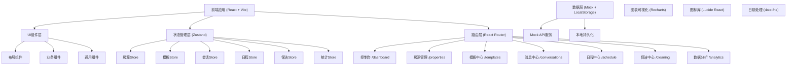
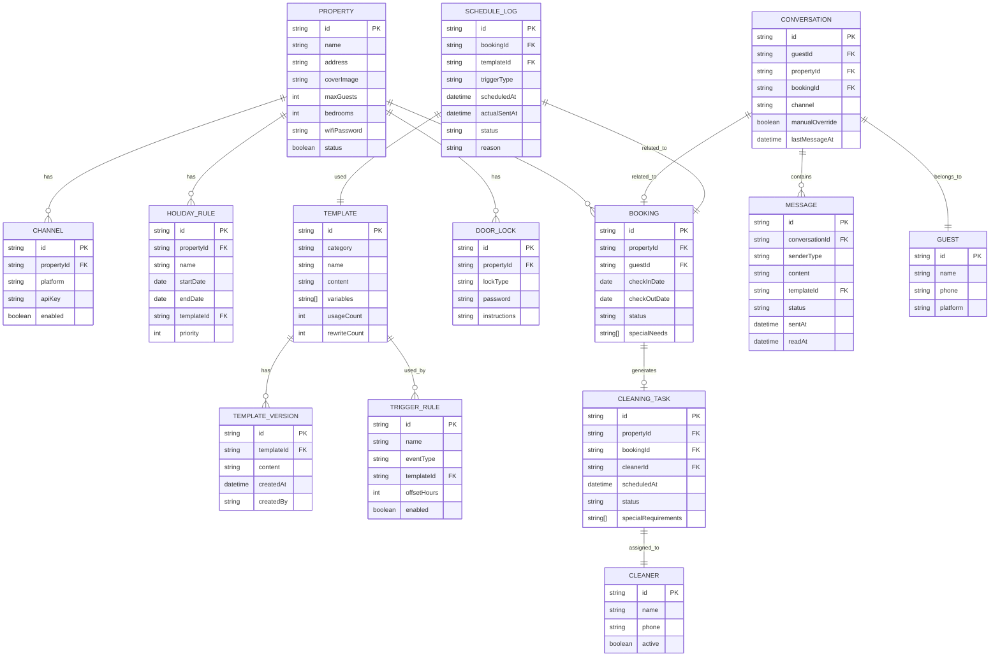

## 1. 架构设计



## 2. 技术描述

- **前端框架**: React@18 + TypeScript
- **构建工具**: Vite@5
- **样式方案**: TailwindCSS@3 + CSS Variables
- **状态管理**: Zustand@4
- **路由管理**: React Router@6
- **UI组件**: 自研组件库（基于设计规范）
- **图表库**: Recharts@2
- **图标库**: Lucide React@0.344
- **日期处理**: date-fns@3
- **数据持久化**: LocalStorage（前端模拟）
- **代码规范**: ESLint + Prettier

## 3. 目录结构

```
src/
├── assets/                 # 静态资源
│   └── images/
├── components/             # 通用组件
│   ├── ui/                 # 基础UI组件
│   │   ├── Button.tsx
│   │   ├── Card.tsx
│   │   ├── Input.tsx
│   │   ├── Modal.tsx
│   │   ├── Table.tsx
│   │   ├── Tabs.tsx
│   │   ├── Tag.tsx
│   │   ├── Switch.tsx
│   │   ├── Badge.tsx
│   │   ├── Avatar.tsx
│   │   ├── Drawer.tsx
│   │   └── Dropdown.tsx
│   ├── layout/             # 布局组件
│   │   ├── Sidebar.tsx
│   │   ├── Header.tsx
│   │   └── MainLayout.tsx
│   └── shared/             # 业务共享组件
│       ├── PropertyCard.tsx
│       ├── MessageBubble.tsx
│       ├── Calendar.tsx
│       ├── TaskCard.tsx
│       └── StatsCard.tsx
├── pages/                  # 页面组件
│   ├── Dashboard/
│   ├── Properties/
│   ├── Templates/
│   ├── Conversations/
│   ├── Schedule/
│   ├── Cleaning/
│   └── Analytics/
├── store/                  # Zustand状态管理
│   ├── usePropertyStore.ts
│   ├── useTemplateStore.ts
│   ├── useConversationStore.ts
│   ├── useScheduleStore.ts
│   ├── useCleaningStore.ts
│   └── useAnalyticsStore.ts
├── types/                  # TypeScript类型定义
│   ├── property.ts
│   ├── template.ts
│   ├── conversation.ts
│   ├── schedule.ts
│   ├── cleaning.ts
│   └── analytics.ts
├── mock/                   # Mock数据
│   ├── properties.ts
│   ├── templates.ts
│   ├── conversations.ts
│   ├── schedule.ts
│   ├── cleaning.ts
│   └── analytics.ts
├── utils/                  # 工具函数
│   ├── date.ts
│   ├── template.ts
│   ├── deduplication.ts
│   └── storage.ts
├── hooks/                  # 自定义Hooks
│   ├── useDeduplication.ts
│   ├── useNightMode.ts
│   └── useAutoTrigger.ts
├── router/                 # 路由配置
│   └── index.tsx
├── App.tsx
├── main.tsx
└── index.css
```

## 4. 路由定义

| 路由路径 | 页面名称 | 模块名称 |
|----------|----------|----------|
| /dashboard | 控制台 | 数据概览、快捷操作 |
| /properties | 房源管理 | 房源列表、编辑、渠道配置、节假日规则 |
| /templates | 模板中心 | 模板分类、编辑器、版本管理 |
| /conversations | 消息中心 | 会话列表、聊天窗口、人工接管 |
| /schedule | 日程中心 | 日历视图、触发规则、触发日志 |
| /cleaning | 保洁中心 | 任务看板、人员管理、任务分配 |
| /analytics | 数据分析 | 统计图表、历史查询、模板分析 |

## 5. 数据模型

### 5.1 数据模型ER图



### 5.2 核心类型定义

```typescript
// 房源相关
interface Property {
  id: string;
  name: string;
  address: string;
  coverImage: string;
  maxGuests: number;
  bedrooms: number;
  bathrooms: number;
  wifiPassword: string;
  status: 'active' | 'inactive';
  channels: Channel[];
  doorLock: DoorLock;
  transportInfo: TransportInfo;
  holidayRules: HolidayRule[];
}

interface Channel {
  id: string;
  platform: 'airbnb' | 'ctrip' | 'meituan' | 'xiaohongshu';
  enabled: boolean;
  nightModeEnabled: boolean;
}

interface DoorLock {
  type: 'smart' | 'keybox' | 'manual';
  password: string;
  instructions: string;
}

interface TransportInfo {
  nearestSubway: string;
  airportTransfer: string;
  parkingInfo: string;
}

interface HolidayRule {
  id: string;
  name: string;
  startDate: Date;
  endDate: Date;
  templateId?: string;
  priority: number;
  cleaningTimeAdjustment: number;
}

// 模板相关
interface MessageTemplate {
  id: string;
  category: 'inquiry' | 'booking_confirm' | 'pre_checkin' | 'checkin_day' | 'during_stay' | 'pre_checkout' | 'checkout_day' | 'cleaning';
  name: string;
  content: string;
  variables: string[];
  usageCount: number;
  rewriteCount: number;
  createdAt: Date;
  updatedAt: Date;
  versions: TemplateVersion[];
}

interface TemplateVersion {
  id: string;
  content: string;
  createdAt: Date;
  createdBy: string;
}

// 会话相关
interface Conversation {
  id: string;
  guestId: string;
  propertyId: string;
  bookingId?: string;
  channel: string;
  manualOverride: boolean;
  lastMessageAt: Date;
  unreadCount: number;
  guest: Guest;
  messages: Message[];
  specialNeeds: SpecialNeed[];
}

interface Guest {
  id: string;
  name: string;
  phone: string;
  platform: string;
  avatar?: string;
}

interface Message {
  id: string;
  conversationId: string;
  senderType: 'guest' | 'auto' | 'manual';
  content: string;
  templateId?: string;
  status: 'sending' | 'sent' | 'delivered' | 'read' | 'failed';
  sentAt: Date;
  readAt?: Date;
  isRewritten?: boolean;
}

interface SpecialNeed {
  type: 'baby_crib' | 'extra_bed' | 'late_checkout' | 'early_checkin' | 'no_smoking' | 'pet_friendly' | 'custom';
  description: string;
  markedAt: Date;
}

// 日程触发相关
interface TriggerRule {
  id: string;
  name: string;
  eventType: 'booking_created' | 'pre_checkin' | 'checkin_day' | 'mid_stay' | 'pre_checkout' | 'checkout_day' | 'checkout_completed';
  templateId: string;
  offsetHours: number;
  enabled: boolean;
  propertyIds: string[];
}

interface ScheduleLog {
  id: string;
  bookingId: string;
  templateId: string;
  triggerType: string;
  scheduledAt: Date;
  actualSentAt?: Date;
  status: 'pending' | 'sent' | 'skipped' | 'failed';
  skipReason?: string;
}

interface Booking {
  id: string;
  propertyId: string;
  guestId: string;
  checkInDate: Date;
  checkOutDate: Date;
  status: 'confirmed' | 'checked_in' | 'checked_out' | 'cancelled';
  specialNeeds: SpecialNeed[];
  guest: Guest;
}

// 保洁相关
interface CleaningTask {
  id: string;
  propertyId: string;
  bookingId: string;
  cleanerId?: string;
  scheduledAt: Date;
  startedAt?: Date;
  completedAt?: Date;
  status: 'pending' | 'assigned' | 'in_progress' | 'completed' | 'cancelled';
  specialRequirements: string[];
  photos: string[];
  notes?: string;
}

interface Cleaner {
  id: string;
  name: string;
  phone: string;
  avatar?: string;
  active: boolean;
  taskCount: number;
  rating: number;
}

// 统计相关
interface TemplateStats {
  templateId: string;
  templateName: string;
  category: string;
  usageCount: number;
  rewriteCount: number;
  rewriteRate: number;
}

interface MessageStats {
  totalSent: number;
  delivered: number;
  read: number;
  failed: number;
  autoReplied: number;
  manualReplied: number;
}

interface PropertyConversationHistory {
  propertyId: string;
  propertyName: string;
  date: Date;
  conversationCount: number;
  messageCount: number;
  autoReplyRate: number;
}
```

## 6. 核心功能实现方案

### 6.1 智能变量替换

```typescript
// utils/template.ts
export function renderTemplate(content: string, data: Record<string, any>): string {
  return content.replace(/\{\{(\w+)\}\}/g, (match, key) => {
    return data[key] !== undefined ? data[key] : match;
  });
}

export function extractVariables(content: string): string[] {
  const matches = content.match(/\{\{(\w+)\}\}/g) || [];
  return [...new Set(matches.map(m => m.slice(2, -2)))];
}
```

### 6.2 重复提醒防护

```typescript
// hooks/useDeduplication.ts
const SENT_MESSAGES_KEY = 'sent_messages_dedup';
const DEDUP_WINDOW = 24 * 60 * 60 * 1000; // 24小时

export function useDeduplication() {
  const shouldSend = (guestId: string, messageType: string): boolean => {
    const sentMessages = getSentMessages();
    const key = `${guestId}_${messageType}`;
    const lastSent = sentMessages[key];
    
    if (!lastSent) return true;
    return Date.now() - lastSent > DEDUP_WINDOW;
  };

  const recordSent = (guestId: string, messageType: string) => {
    const sentMessages = getSentMessages();
    const key = `${guestId}_${messageType}`;
    sentMessages[key] = Date.now();
    localStorage.setItem(SENT_MESSAGES_KEY, JSON.stringify(sentMessages));
  };

  return { shouldSend, recordSent };
}
```

### 6.3 深夜模式判断

```typescript
// hooks/useNightMode.ts
export function useNightMode() {
  const isNightTime = (): boolean => {
    const now = new Date();
    const hour = now.getHours();
    return hour >= 22 || hour < 8;
  };

  const getNextWorkTime = (): Date => {
    const now = new Date();
    const nextWorkTime = new Date(now);
    
    if (now.getHours() >= 22) {
      nextWorkTime.setDate(nextWorkTime.getDate() + 1);
    }
    nextWorkTime.setHours(8, 30, 0, 0);
    
    return nextWorkTime;
  };

  return { isNightTime, getNextWorkTime };
}
```

### 6.4 自动触发引擎

```typescript
// hooks/useAutoTrigger.ts
export function useAutoTrigger() {
  const processTriggers = useCallback(async () => {
    const { triggerRules } = useScheduleStore.getState();
    const { bookings } = useScheduleStore.getState();
    
    const now = new Date();
    
    for (const booking of bookings) {
      if (booking.status !== 'confirmed' && booking.status !== 'checked_in') continue;
      
      for (const rule of triggerRules) {
        if (!rule.enabled) continue;
        if (rule.propertyIds.length > 0 && !rule.propertyIds.includes(booking.propertyId)) continue;
        
        const triggerTime = calculateTriggerTime(booking, rule);
        
        if (shouldTrigger(triggerTime, now, booking.id, rule.id)) {
          await sendTriggeredMessage(booking, rule);
        }
      }
    }
  }, []);

  return { processTriggers };
}
```

## 7. Mock数据规范

所有Mock数据需包含：
- 至少5个房源数据，涵盖不同房型和配置
- 至少15个消息模板，覆盖所有分类
- 至少20个会话数据，包含不同渠道和状态
- 至少10个预订数据，分布在不同日期
- 至少8个保洁任务，涵盖不同状态
- 至少30天的统计数据

数据生成时间范围：最近30天内，部分预订延伸至未来15天。
